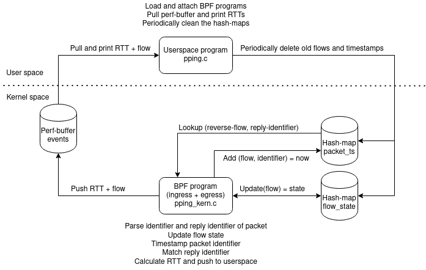

# ePPing - evolved Passive Ping using XDP and tc-BPF
A re-implementation of [Kathleen Nichols' passive ping
(pping)](https://github.com/pollere/pping) utility using BPF programs to
efficiently process packets in the kernel. This eliminates the need for cloning
packets and sending them to user space like traditional packet capturing
does. For egress traffic ePPing uses tc-BPF hook and for ingress traffic it can
either use tc or XDP.

## Simple description
Evolved Passive Ping (ePPing) is a simple tool for passively measuring per-flow
RTTs. It can be used on endhosts as well as any (BPF-capable Linux) device which
can see both directions of the traffic (ex router or middlebox). Currently it
works for TCP traffic which uses the TCP timestamp option and ICMP echo
messages, but could be extended to also work with for example TCP seq/ACK
numbers, the QUIC spinbit and DNS queries. See the [TODO-list](./TODO.md) for
more potential features (which may or may not ever get implemented).

The fundamental logic of pping is to timestamp a pseudo-unique identifier for
packets, and then look for matches in the reply packets. If a match is found,
the RTT is simply calculated as the time difference between the current time and
the stored timestamp.

This tool, just as Kathie's original pping implementation, uses TCP timestamps
as identifiers for TCP traffic. The TSval (which is a timestamp in and off
itself) is used as an identifier and timestamped. Reply packets in the reverse
flow are then parsed for the TSecr, which are the echoed TSval values from the
receiver. The TCP timestamps are not necessarily unique for every packet (they
have a limited update frequency, appears to be 1000 Hz for modern Linux
systems), so only the first instance of an identifier is timestamped, and
matched against the first incoming packet with a matching reply identifier. The
mechanism to ensure only the first packet is timestamped and matched differs
from the one in Kathie's pping, and is further described in
[SAMPLING_DESIGN](./SAMPLING_DESIGN.md).

For ICMP echo, it uses the echo identifier as port numbers, and echo sequence
number as identifer to match against. Linux systems will typically use different
echo identifers for different instances of ping, and thus each ping instance
will be recongnized as a separate flow. Windows systems typically use a static
echo identifer, and thus all instaces of ping originating from a particular
Windows host and the same target host will be considered a single flow.

## Output formats
ePPing currently supports two different forms out output: individual reports for
each RTT or periodically aggregated reports per IP-prefix. Additionally, it
supports 3 different formats for the output (set with the `-F/--format` option):
*standard*, *ppviz* and *json*.

### Individual RTT reports
In the individual RTT reports mode, the output consists of two different types
of events: flow-events which gives information that a flow has started/ended,
and RTT-events which provides information on a computed RTT within a flow.

#### Standard format
The standard format is quite similar to the Kathie's pping default output, and
is generally intended to be an easily understood human-readable format writing a
single line per event.

An example of the format is provided below:
```shell
16:00:46.142279766 TCP 10.11.1.1:5201+10.11.1.2:59528 opening due to SYN-ACK from dest
16:00:46.147705205 5.425439 ms 5.425439 ms TCP 10.11.1.1:5201+10.11.1.2:59528
16:00:47.148905125 5.261430 ms 5.261430 ms TCP 10.11.1.1:5201+10.11.1.2:59528
16:00:48.151666385 5.972284 ms 5.261430 ms TCP 10.11.1.1:5201+10.11.1.2:59528
16:00:49.152489316 6.017589 ms 5.261430 ms TCP 10.11.1.1:5201+10.11.1.2:59528
16:00:49.878508114 TCP 10.11.1.1:5201+10.11.1.2:59528 closing due to RST from dest
```

#### ppviz format
The ppviz format is primarily intended to be used to generate data that can be
visualized by Kathie's [ppviz](https://github.com/pollere/ppviz) tool. The
format is essentially a CSV format, using a single space as the separator, and
is further described [here](http://www.pollere.net/ppviz.html).

Note that the optional *FBytes*, *DBytes* and *PBytes* from the format
specification have not been included here, and do not appear to be used by
ppviz. Furthermore, flow events are not included in the output, as the those are
not used by ppviz.

An example of the format is provided below:
```shell
1623420121.483727575 0.005298909 0.005298909 10.11.1.1:5201+10.11.1.2:59532
1623420122.484530934 0.006016639 0.005298909 10.11.1.1:5201+10.11.1.2:59532
1623420123.485899736 0.005590783 0.005298909 10.11.1.1:5201+10.11.1.2:59532
1623420124.490584753 0.006123511 0.005298909 10.11.1.1:5201+10.11.1.2:59532
1623420125.492190751 0.005624835 0.005298909 10.11.1.1:5201+10.11.1.2:59532
```
#### JSON format
The JSON format is primarily intended to be machine-readable, and thus uses no
spacing or newlines between entries to reduce the overhead. External tools such
as [jq](https://stedolan.github.io/jq/) can be used to pretty-print the format.

The format consists of an array at the root-level, and each flow or RTT even is
added as an object to the root-array. The events contain some additional fields
in the JSON format which is not displayed by the other formats. All times
(*timestamp*, *rtt* and *min_rtt*) are provided as integers in nanoseconds.

An example of a (pretty-printed) flow-event is provided below:
```json
{
    "timestamp": 1623420837244545000,
    "src_ip": "10.11.1.1",
    "src_port": 5201,
    "dest_ip": "10.11.1.2",
    "dest_port": 59572,
    "protocol": "TCP",
    "flow_event": "opening",
    "reason": "SYN-ACK",
    "triggered_by": "dest"
}
```

An example of a (pretty-printed) RTT-even is provided below:
```json
{
    "timestamp": 1623420838254558500,
    "src_ip": "10.11.1.1",
    "src_port": 5201,
    "dest_ip": "10.11.1.2",
    "dest_port": 59572,
    "protocol": "TCP",
    "rtt": 5977708,
    "min_rtt": 5441848,
    "sent_packets": 9393,
    "sent_bytes": 492457296,
    "rec_packets": 5922,
    "rec_bytes": 37,
    "match_on_egress": false
}
```

### Aggregated output
The aggregated output form is useful if you are monitoring a lot of traffic
where reporting individual RTTs can result in an overwhelming amount of
output. If you are only interested in the overall distribution of the RTTs
rather than each RTT value, the aggregated output can greatly reduce the amount
of output and the overhead tied to generating that output when monitoring many
concurrent flows.

To enable aggregated output, use the `-a/--aggregate <interval>` option.

#### IP prefix input format
The aggregated mode aggregates RTTs per IP-prefix. To specify which IP-prefixes
the traffic should be aggregated for, the user can provide a file containing all
prefixes with the `-p/--prefix-file` option. The input file should list a single
IP-prefix per line. Both IPv4 and IPv6 prefixes are supported. The RTTs are
matched on the Longest Prefix Match (LPM), so you may create overlapping
prefixes to catch RTTs that don't fit a more specific prefix. To catch all RTTs,
the global prefix ::/0 can be used. If no prefixes are provided all RTTs will be
aggregated under the global prefix.

An example of the IP-prefix input
```
10.11.1.2/32
10.11.1.0/24
fc00:dead:cafe:1::2/128
fc00::/16
::/0
```

##### Note on IPv6 and IPv4
Internally ePPing treats everything as IPv6. IPv4 addresses are under the hood
mapped to IPv6 ones by prefixing them with ::ffff:0:0/96 in accordance with [RFC
4291](https://www.rfc-editor.org/rfc/rfc4291.html#section-2.5.5.2). This means
that if you add an IPv6 prefix which encompasses ::ffff:0:0/96, e.g. ::/0, it
may contain RTTs from both IPv6 and IPv4 traffic.


#### Standard format
The standard format is intended to provide a human readable overview of RTT
statistics. An example is provided below:
```shell
14:25:46.362191079: 10.11.1.2/32 -> count=10, min=20.343277 ms, mean=57.40 ms, median=65.00 ms, p95=78.90 ms, max=82.978091 ms
14:25:46.362191079: 10.11.1.0/24 -> count=1256, min=10.316172 ms, mean=50.57 ms, median=50.50 ms, p95=86.50 ms, max=90.034391 ms
14:25:46.362191079: fc00::/16 -> count=99, min=10.365419 ms, mean=50.70 ms, median=54.50 ms, p95=84.50 ms, max=89.978475 ms
```

#### ppviz format
The aggregated output does not support the ppviz format.

#### JSON format
The JSON format is primarily intended to be machine-readable for later post
processing. The JSON format includes a histogram of all RTTs, making it possible
to calculate approximate distribution metrics like mean, variation and
percentiles.

An example of an aggregated RTT report in JSON format is provided below.
```json
{
    "timestamp": 1676039038377084700,
    "ip_prefix": "10.11.1.0/24",
    "min_rtt": 10233155,
    "mean_rtt": 49960900,
    "median_rtt": 49500000,
    "p95_rtt": 85500000,
    "max_rtt": 90102445,
    "bin_width": 1000000,
    "histogram": [
      0,
      0,
      0,
      0,
      0,
      0,
      0,
      0,
      0,
      0,
      16,
      15,
      14,
      22,
      10,
      12,
      12,
      13,
      9,
      13,
      ... (output truncuated)
    ]
}

```

## Design and technical description


### Files:
- **pping.c:** Userspace program that loads and attaches the BPF programs, pulls
  the perf-buffer `events` to print out RTT messages and periodically cleans
  up the hash-maps from old entries. Also passes user options to the BPF
  programs by setting a "global variable" (stored in the programs .rodata
  section).
- **pping_kern.c:** Contains the BPF programs that are loaded on egress (tc) and
  ingress (XDP or tc), as well as several common functions, a global constant
  `config` (set from userspace) and map definitions. Essentially the same pping
  program is loaded on both ingress and egress. All packets are parsed for both
  an identifier that can be used to create a timestamp entry `packet_ts`, and a
  reply identifier that can be used to match the packet with a previously
  timestamped one in the reverse flow. If a match is found, an RTT is calculated
  and an RTT-event is pushed to userspace through the perf-buffer `events`. For
  each packet with a valid identifier, the program also keeps track of and
  updates the state flow and reverse flow, stored in the `flow_state` map.
- **pping.h:** Common header file included by `pping.c` and
  `pping_kern.c`. Contains some common structs used by both (are part of the
  maps).

### BPF Maps:
- **flow_state:** A hash-map storing some basic state for each flow, such as the
  last seen identifier for the flow and when the last timestamp entry for the
  flow was created. Entries are created, updated and deleted by the BPF pping
  programs. Leftover entries are eventually removed by userspace (`pping.c`).
- **packet_ts:** A hash-map storing a timestamp for a specific packet
  identifier. Entries are created by the BPF pping program if a valid identifier
  is found, and removed if a match is found. Leftover entries are eventually
  removed by userspace (`pping.c`).
- **events:** A perf-buffer used by the BPF programs to push flow or RTT events
  to `pping.c`, which continuously polls the map the prints them out.


## Similar projects
Passively measuring the RTT for TCP traffic is not a novel concept, and there
exists a number of other tools that can do so. A good overview of how passive
RTT calculation using TCP timestamps works is provided in [this
paper](https://doi.org/10.1145/2523426.2539132) from 2013.

- [pping](https://github.com/pollere/pping): The original PPing tool developed
  by Kathleen Nichols, which relies on packet capturing (libtins) instead of BPF.
- [ppviz](https://github.com/pollere/ppviz): Web-based visualization tool for
  the "machine-friendly" (-m) output from the original PPing. This BPF based
  ePPing can also generate output that can be used by ppviz by using
  `--format="ppviz"`.
- [tcptrace](https://github.com/blitz/tcptrace): A post-processing tool which
  can analyze a tcpdump file and among other things calculate RTTs based on
  seq/ACK numbers (`-r` or `-R` flag).
- **Dapper**: A passive TCP data plane monitoring tool implemented in P4 which
  can among other things calculate the RTT based on the matching seq/ACK
  numbers. [Paper](https://doi.org/10.1145/3050220.3050228). [Unofficial
  source](https://github.com/muhe1991/p4-programs-survey/tree/master/dapper).
- [P4 Tofino TCP RTT measurement](https://github.com/Princeton-Cabernet/p4-projects/tree/master/RTT-tofino): 
  A passive TCP RTT monitor based on seq/ACK numbers implemented in P4 for
  Tofino programmable switches. [Paper](https://doi.org/10.1145/3405669.3405823).
